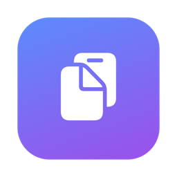
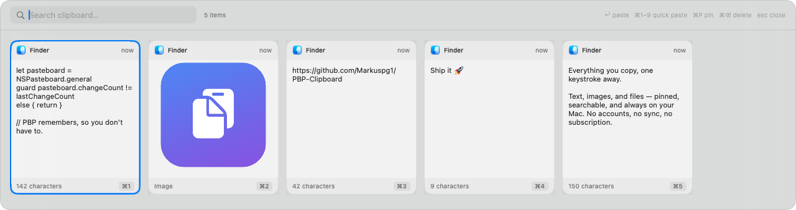

<div align="center">



# PBP - Clipboard

**Everything you copy, one keystroke away.**

A free, native macOS clipboard manager — a lightweight replacement for
subscription apps like Paste. The name nods to `pbcopy`/`pbpaste`:
PBP is the pasteboard, remembered.

[](https://swift.org)
[](#-install)
[](LICENSE)
[](#)



*Press <kbd>⇧</kbd><kbd>⌘</kbd><kbd>V</kbd> anywhere — your clipboard history slides up as cards.*

</div>

## ✨ Features

- 📋 **Full clipboard history** — text, images, and copied files, captured
  automatically and persisted across restarts (up to 500 items, deduped).
- ⚡ **Paste in place** — the panel never steals your app's focus; picking a
  card pastes straight into where your cursor was (via Accessibility).
  Without the permission, the card is copied and you press ⌘V yourself.
- 🔍 **Instant search** — the panel opens with the search field focused;
  just start typing.
- 📌 **Pinning** — pinned cards stay at the front and survive
  *Clear Unpinned History*.
- 🔒 **Privacy-aware** — skips anything marked transient or concealed
  (password managers like 1Password flag their copies this way). Nothing
  ever leaves your Mac: no accounts, no sync, no telemetry.
- 🖥 **Native and tiny** — a menu-bar app in Swift (AppKit + SwiftUI),
  ~500 KB binary, builds with SwiftPM alone. No Xcode project, no Electron.
- 🚀 **Launch at Login** toggle built into the menu-bar menu.

## ⌨️ Shortcuts

| Keys | Action |
|------|--------|
| <kbd>⇧</kbd><kbd>⌘</kbd><kbd>V</kbd> | Open / close the panel, from any app |
| <kbd>←</kbd> <kbd>→</kbd> (or <kbd>↑</kbd> <kbd>↓</kbd>) | Move between cards |
| <kbd>↩</kbd> | Paste the selected card |
| <kbd>⌘</kbd><kbd>1</kbd>…<kbd>9</kbd> | Paste card *n* instantly |
| <kbd>⌘</kbd><kbd>P</kbd> | Pin / unpin the selected card |
| <kbd>⌘</kbd><kbd>⌫</kbd> | Delete the selected card |
| <kbd>esc</kbd> | Close the panel |
| *just type* | Search |

Clicking a card pastes it; right-click for pin / copy / delete.

## 🚀 Install

Requires macOS 13+ and the Xcode Command Line Tools (`xcode-select --install`).

```bash
git clone https://github.com/Markuspg1/PBP-Clipboard.git
cd PBP-Clipboard
./make-app.sh --install
```

That builds `PBP.app` (ad-hoc signed), installs it to `/Applications`, and
launches it. Then:

1. A clipboard icon appears in the menu bar.
2. On recent macOS versions the first copy may trigger a **clipboard access**
   prompt — choose **Always Allow** (remembering your clipboard is the app's
   whole job).
3. For paste-in-place, pick **Enable Auto-Paste (Accessibility)…** from the
   menu-bar menu and add PBP in System Settings → Privacy & Security →
   Accessibility. (Re-add it if you move or rebuild the app.)
4. Flip on **Launch at Login** from the menu.

> **Tip — always use `--install` rather than dragging the app in Finder.**
> If your checkout lives in an iCloud-synced folder, Finder-dragging the app
> carries iCloud file-provider xattrs along, which invalidate the signature —
> the app then shows up grayed out and won't launch. `--install` strips the
> xattrs and re-signs at the destination. Already stuck? Run:
> `xattr -cr /Applications/PBP.app && codesign --force --sign - /Applications/PBP.app`

During development, `swift run` works too (Launch at Login needs the real
.app bundle, everything else works).

## 🛠 Scripting

The panel can be toggled from anywhere — shell scripts, BetterTouchTool,
Karabiner, launchers:

```bash
notifyutil -p com.marco.pbp.toggle
```

The default hotkey ⇧⌘V is defined in `Sources/PBP/HotkeyManager.swift`
(note some apps use ⇧⌘V for "paste without formatting").

## 🗂 Data

History lives in `~/Library/Application Support/PBP/` (`history.json` plus an
`images/` folder). Delete that folder to wipe everything, or use
*Clear Unpinned History* / *Clear Everything…* from the menu.

**Uninstall:** quit from the menu bar, delete `/Applications/PBP.app` and the
Application Support folder, and remove PBP from Accessibility settings.

## 🧭 Known limitations (v1)

- Plain text only — rich text/RTF formatting is not preserved.
- The hotkey isn't configurable from the UI yet.
- Copied-file cards store file *paths* — pasting breaks if the original
  file is deleted.
- No sync between Macs (by design, for now: your clipboard stays local).

## 📄 License

[MIT](LICENSE) © Marco Pereira
